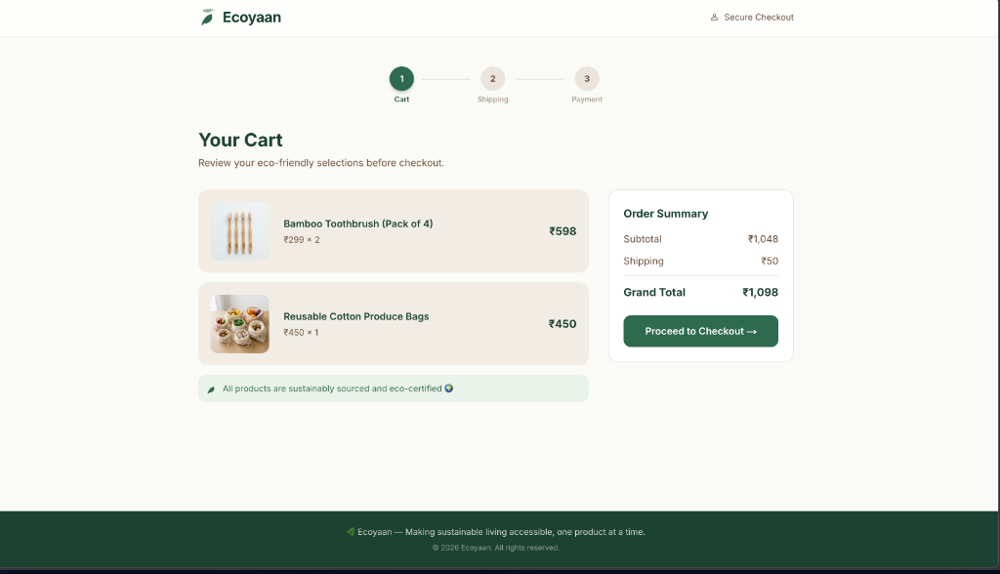

# 🌿 Ecoyaan Checkout Flow

A responsive, SSR-powered e-commerce checkout flow built for the **Ecoyaan** platform — a marketplace for sustainable and healthy products.

**Live Demo**: [vivek-ecoyaan-nextjs-checkout.vercel.app](https://vivek-ecoyaan-nextjs-checkout.vercel.app)

<p align="center">
  
</p>

---

## 🛒 Features

- **3-Step Checkout Flow**: Cart → Shipping Address → Payment Confirmation → Success
- **Server-Side Rendering**: Cart data fetched asynchronously in Server Components at request time
- **Form Validation**: Field-level validation with real-time error feedback (email, phone, PIN code)
- **State Management**: Zustand store persists shipping address across checkout steps
- **Sustainability Theme**: Earthy greens, warm neutrals, Inter typography — aligned with Ecoyaan's brand
- **Responsive Design**: Mobile-first layout with adaptive grid for desktop

---

## 🏗️ Architecture

### Tech Stack

| Layer | Choice | Rationale |
|-------|--------|-----------|
| Framework | **Next.js 16 (App Router)** | Server Components + API routes for SSR |
| Styling | **Tailwind CSS** | Rapid prototyping with consistent design tokens |
| State | **Zustand** | Lighter than Redux; no Provider wrappers; cleaner than Context for cross-page state |
| Language | **TypeScript** | Type safety across components, store, and API |

### Why Zustand over Context API?

Context re-renders all consumers when any value changes, and needs a Provider wrapper. Zustand gives me selector-based subscriptions and works as a plain hook — better fit for persisting address data across checkout pages.

### Data Fetching Pattern

Server Components import a shared `getCartData()` function that simulates an async backend call (with latency). A standalone `/api/cart` route also exists to demonstrate how Next.js API routes work — in production this is where you'd connect a real DB.

### Folder Structure

```
src/
├── app/
│   ├── api/cart/route.ts        # Mock backend API (returns cart JSON)
│   ├── checkout/page.tsx        # Step 2: Shipping address form
│   ├── confirmation/
│   │   ├── page.tsx             # Step 3: Server Component (SSR cart data)
│   │   └── ConfirmationClient.tsx # Client wrapper (reads Zustand store)
│   ├── success/page.tsx         # Order success screen
│   ├── page.tsx                 # Step 1: Cart (Server Component, SSR)
│   ├── layout.tsx               # Root layout (Inter font, Navbar, Footer)
│   └── globals.css              # Tailwind config + Ecoyaan theme tokens
├── components/
│   ├── AddressForm.tsx          # Form with field-level validation
│   ├── CartItem.tsx             # Product card with image, price, quantity
│   ├── OrderSummary.tsx         # Subtotal, shipping, total breakdown
│   ├── StepIndicator.tsx        # 3-step progress bar with checkmarks
│   ├── Navbar.tsx               # Glassmorphism nav with leaf branding
│   └── Footer.tsx               # Sustainability tagline footer
├── store/
│   └── useCheckoutStore.ts      # Zustand: shipping address + order state
└── lib/
    ├── cartService.ts           # Shared async data-fetching layer
    ├── mockData.ts              # Ecoyaan-provided cart data
    └── types.ts                 # CartItem, CartData, ShippingAddress interfaces
```

---

## 🚀 Getting Started

### Prerequisites
- Node.js 18+
- npm

### Run Locally

```bash
git clone https://github.com/alwaysvivek/vivek-ecoyaan-nextjs-checkout.git
cd vivek-ecoyaan-nextjs-checkout
npm install
npm run dev
```

Open [http://localhost:3000](http://localhost:3000) in your browser.

### Build for Production

```bash
npm run build
npm start
```

---

## 📝 Notes

> While this MVP is built using the Next.js/React ecosystem as requested, my background in backend systems (FastAPI, Flask, Django) makes me comfortable with structured, type-safe environments similar to .NET. The API route pattern used here (`/api/cart`) mirrors the controller-based architecture common in .NET Web API projects.
